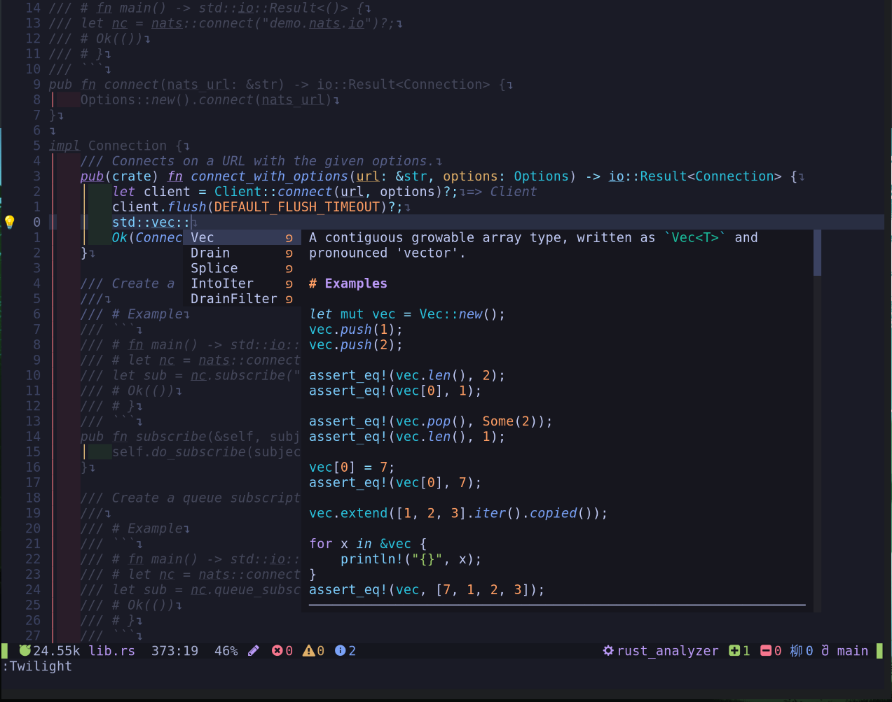

# Neovim configuration

This is my nvim configuration. I use it to work with **rust** and **go lang** programs (LSP). But highlight works for all maintained languages with tree-sitter. It should be easy to add new languages.



## Installation

### Requirements

__There can be more binaries that are required but some could be installed already in my OS use `checkhealth`__

<details>
  <summary>Arch-linux based systems</summary>

```sh
sudo pacman -S ripgreap \ # for telescope
    tar curl \ # nvim-treesitter
    community/wl-clipboard # allow copy/past to `+` register (system) on Wayland

pamac build stylua-bin
go install github.com/lighttiger2505/sqls  # for SQL support with LSP (need configuration file in $HOME/.config/config.yml)
```

LSPs:
```sh
sudo pacman -S \
    lua-language-serve \
	rust-analyzer rust \
    go gopls revive \ # golang
	
```
</details>

<details>
  <summary>Ubunut based systems</summary>

TODO
</details>

### Plugins

Download neovim configuration:
```sh
git clone https://github.com/xoac/nvim ~/.config/
```

Next you need to run `nvim` (you got some errors) and then `:PackerSync`. Unfortunately you need to close `nvim` and repeat procedure until you are out of errors (this is bug).

## Structure

This configuration uses a different approach than the standard ones. Most of them have a struct of files like this:
<details>
  <summary> Standard structure </summary>

```
├── init.lua
├── lua
│   ├── keymap
│   │   ├── buffer.lua
│   │   ├── escape.lua
│   │   ├── global.lua
│   │   ├── init.lua
│   │   ├── lsp.lua
│   │   ├── move.lua
│   │   ├── neovide.lua
│   │   ├── resize.lua
│   │   ├── toggleterm.lua
│   │   └── window.lua
│   ├── lsp
│   │   ├── config
│   │   │   ├── init.lua
│   │   │   ├── rust.lua
│   │   │   ├── s-lua.lua
│   │   │   ├── styl.lua
│   │   │   └── ts-js.lua
│   │   ├── init.lua
│   │   ├── lsp-setup.lua
│   │   └── ts-js-deno.lua
│   ├── packer
│   │   ├── loader.lua
│   │   ├── plugins.lua
│   │   └── settings
│   │       ├── alpha.lua
│   │       ├── autopairs.lua
│   │       ├── bufferline.lua
│   │       ├── compe.lua
│   │       ├── format.lua
│   │       ├── kommantary.lua
│   │       ├── luasnip.lua
│   │       ├── nvimtree.lua
│   │       ├── snippets
│   │       │   ├── global.lua
│   │       │   ├── init.lua
│   │       │   ├── lua.lua
│   │       │   └── rust.lua
│   │       ├── toggleterm.lua
│   │       ├── treesitter.lua
│   │       ├── which-key.lua
│   │       └── windline.lua
│   ├── settings.lua
│   └── terminal.lua
```
</details>
<br/>

**My approach should be simpler, and looks like this:**

<details> 
  <summary>One plugin one file approach</summary>

```
├── init.lua
├── lua
│   ├── packer
│   │   ├── loader.lua
│   │   └── plugs
│   │       ├── bufferline.lua
│   │       ├── comment.lua
│   │       ├── formatter.lua
│   │       ├── gitsigns.lua
│   │       ├── indent-blankline.lua
│   │       ├── init.lua
│   │       ├── lightbulb.lua
│   │       ├── lsp
│   │       │   ├── go.lua
│   │       │   ├── init.lua
│   │       │   ├── rust.lua
│   │       │   └── sql.lua
│   │       ├── luasnip.lua
│   │       ├── nvim-treesitter.lua
│   │       ├── packer.lua
│   │       ├── renamer.lua
│   │       ├── telescope.lua
│   │       ├── tokyonight.lua
│   │       ├── trouble.lua
│   │       ├── twilight.lua
│   │       ├── which-key.lua
│   │       └── windline.lua
│   └── settings.lua
```
</details>
</br>

**The rules are:**
1. In `lua/packer/plugs/init.lua` - one line, one plugin
2. in `lua/packer/plugs/<plug_name>.lua` - one file, one plugin with settings and key mapping
3. In `lua/packer/plugs/<folder>` - a group of plugins that add special functionality. In my case LSP 
4. There are 2 plugins that should be accessible everywhere:
    - `packer` with global variable `packer` - used to add more plugins
    - `which-key` that should be accessed with `local wk = require("which-key")` and this is suggested way to add new key mapping


**Example benefits of this approach**:
  - disable one plugin with all settings and key mapping, all you need is to comment one line in `/lua/packer/plugs/init.lua`
  - conflict key mapping you can check with `checkhealth which-key`
  - if you want modify plugin settings you only look in one file.
  - should be simpler for beginners 

### Credits

I was looking for inspiration in this repositories:

 - https://github.com/MiaadTeam/lesvim
 - https://github.com/jonhoo/configs

### Contribiution

Feel free to open PR or issue.
